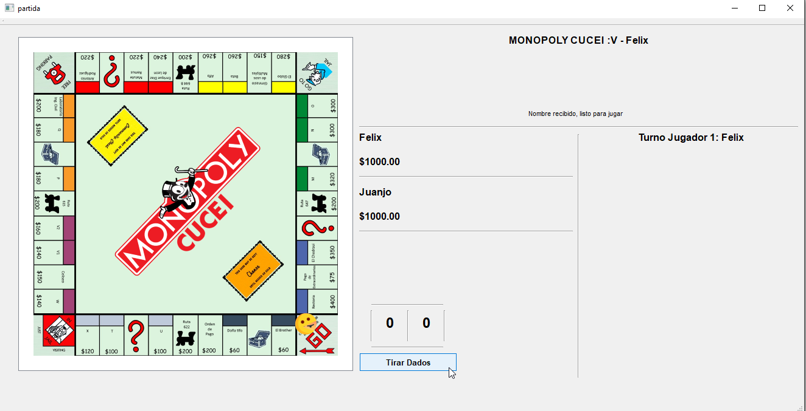

# Monopoly-CUCEI
Monopoly edición CUCEI, desarrollado en Qt para la materia Programación para internet (versión censurada por el profesor)
## Pantalla inicial

## Primer turno después de la conexión exitosa

## Primer turno después de la conexión exitosa - pantalla del jugador 2

## Screenshots de pantallas comunes de un juego

